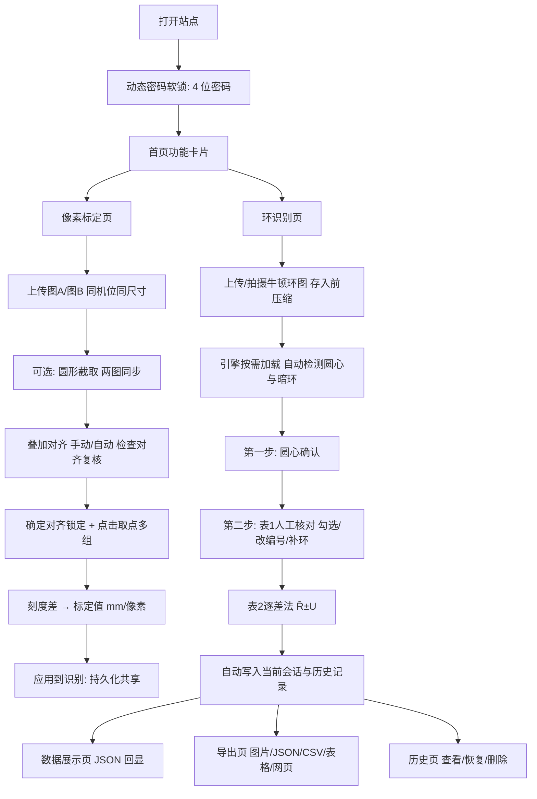

# 🔬 牛顿环测量工具 — 操作流程与 UX 建议账本

> 基于本仓库 `main` 现状（2026-09）梳理，旧单页应用（`index.html` + 双 Tab）的流程与《交接文档》差异附录已废弃，以本文为准。
> 第一部分为端到端操作流程；第二部分为旧版 11 条 UX 建议在新版中的处理状态。工程决策与待办见 `CHANGELOG.md`，本文不重复。

---

## 第一部分 · 完整操作流程

### 总览

> 主线：**先标定 → 后识别 → 再导出/留档**。标定值与识别结果经跨页 store 共享；已有可靠标定值时可跳过标定页，直接在识别页输入。

### 阶段 0 · 入口与全局

1. **访问**：线上 GitHub Pages（push `main` 自动部署）；本地开发 `pnpm dev`（见 README）。hash 路由 + 相对 base，产物可放任意子路径。
2. **动态密码软锁**（纯前端"防君子"）：
   - 4 位密码 = **日×2 拼接 时×2**（各补零 2 位）。例：13 日 14 时 → `26` `28` → **2628**。
   - 当前小时或前一小时的密码均有效，每整点变化；解锁后本会话内（sessionStorage）不再询问。
   - **2026-09-25 00:00 起自动失效**，此后无需密码。
3. **图像引擎按需加载**：OpenCV（约 10 MB）进入页面**不预载**；在识别页首次执行上传/重新检测等动作时才触发加载，按钮呈 loading 态，期间主线程短暂冻结属正常。
4. **全局布局**：顶栏 = 菜单折叠 + Logo + **水印开关** + **深浅主题切换**（均持久化）；左侧菜单由路由表单一来源生成，底部为**本站二维码**（随当前 host 生成，讲课扫码即用）；移动端菜单为左抽屉。

### 页面 · 像素标定（`/calibration`）

**目的**：转动测微鼓轮移动已知距离，前后同机位拍两张图，求出真实 mm/像素。页面顶部自带 5 步操作指引卡，按序做即可。

1. **上传图A（移动前）/图B（移动后）**：必须同机位、同尺寸，不一致会红字告警无法叠加；支持全部重置。
2. **鼓轮刻度**：分别输入两图读数显微镜刻度，`|刻度A−刻度B|` 自动算作物理距离（3 位小数），也可手动覆盖。
3. **✂️ 圆形截取（可选，只对齐中心环区时推荐）**：在图A上拖圆框选——拖圆内移圆心、拖右侧红手柄改半径（滑块 / ± 按钮 / 键盘 `+` `−`（Shift 加速）四种方式等价；方向键移圆心、`Home` 复位；半径 20px ~ 短边一半，靠边自动内推）。确认后两图按**相同位置**剪下同一块**方形**区域。
   - 为何存方形而非圆形抠图：圆外透明像素会被算法读成纯黑，人工圆边在两图位置完全相同，会把对齐"锁死"在偏移≈0 而环纹依旧错开。
   - 截取后可重新裁剪 / 恢复原图（沿用上次参数免重传）；已锁定或已取点时会先弹确认。
4. **🔍 叠加对齐**（图A为底、图B半透明；两路径共享同一偏移，二选一）：
   - 手动：Δx/Δy 滑块或方向键（Shift = 5px），开 **👁 闪烁对比**——错位时环纹跳动、对齐后跳动消失；
   - 自动：**🤖 全局对齐**从任意偏移一键求解平移（整图相关 + PSR 置信闸门，亚像素，不假阳性）；
   - 复核：**🔍 检查对齐**给出权威残差 + PSR + 调整方向建议。环纹具自相似性，肉眼"看似重叠"不可信，以此结果为准；
   - **🔒 确定对齐**锁定偏移后方可取点，再点解锁。
5. **取点**：在叠加画面点击同一物理特征点，每点一次新增一组（A/B 坐标、ΔX、ΔY、像素距离、该组标定值），可单删/清空；像素值保留 2 位小数。
6. **标定值** = 物理距离 ÷ 像素距离（多组取平均，固定 4 位有效数字），点 **「应用到识别」** 写入跨页 store 并**持久化**——刷新后识别页仍在（旧版"不持久化"口径已作废）。
7. **缓存**：双图、刻度、取点自动存 sessionStorage，刷新不丢；图片过大时降级为只存非图片数据。

### 页面 · 环识别（`/recognition`）

1. **图像来源**：点击或拖拽上传（JPG/PNG/WEBP，可多选批量，但**只自动处理最后一张**，切换缩略图时才处理其余）；存入前自动压缩（最长边 1600 px、JPEG 0.85）。「导入标定图A/B」跨页按钮**尚未实现**（CHANGELOG 待办）。
2. **自动管线**：灰度 → CLAHE 增强 → 中值去噪；圆心 = 霍夫外边界 → 亮度加权质心兜底 → "圆周亮度标准差最小"精修；暗环 = 多角度径向剖面 → 局部极小 → 非极大值抑制 → 半径聚类 → **r²∝m 线性拟合精修**。按半径升序编号 1..N——**隐含假设最内圈 = 第 1 级暗环**，核对环节可人工改。
3. **🎯 第一步 · 圆心确认**：拖拽 / 方向键微调（Shift 5px）/ 直接输入 X、Y / `+` `−` 调十字臂长；**圆心可移出图片**（光学中心在图外时边缘画指向箭头并动态重算搜索半径）；不满意可「重新检测」。
4. **✋ 第二步 · 环人工核对**：表1取消勾选剔误检、编号直接可改、可一键**顺延重排**（启用环按半径重编 1..N）；漏检时**点击图像该半径处补环**，或 **「⛶ 全屏放大补环」**（滚轮缩放/拖拽平移/点击补环/ESC 关闭，补环只取决于点击半径）；未勾选环不参与计算与绘图。
5. **标定值**：页顶显示当前值可手改；空 / ≤0 视为未设定 → 直径 mm 与 R 降级 `—`、不确定度告警、CSV 导出被拦截，页面给出「去标定页获取标定值」入口。
6. **预处理预览**（折叠项）：滤镜滑杆仅作 CSS 实时预览，**不参与识别管线**（旧版真实改变 CLAHE 参数的调参条已随抽芯移除）。
7. **结果**：表1 直径（像素 2 位小数 / mm 3 位小数，勾选与图像双向联动高亮）；表2 逐差法（**步长 m−n 默认 5**，可改）；`R̄ ± U`（p=0.683、k=1、示值误差限 Δ=0.002 mm，五步评定明细可展开，修约四舍六入五成双）。
8. **留档**：结果可一键**保存到历史并同步当前会话**（标注图 + 数据），或跳转导出页。

### 页面 · 数据展示（`/data`）

导入导出的结果 JSON 回显表1/表2/不确定度（与导出格式**互逆**）；当前已有识别会话时可一键载入，免走 JSON 往返。

### 页面 · 导出（`/export`）

导出源优先当前会话，其次页面导入的 JSON。五种：**标注图片 PNG · 结果 JSON · CSV（含 BOM，Excel 不乱码）· 表格 Markdown · 网页 HTML**；图片导出需含原图（纯 JSON 导入无标注图时不可用）。

### 页面 · 历史记录（`/history`）

2×2 图片方格；查看 / 恢复（写回当前会话）/ 删除 / 清空；最多 **20 条**，超出按 LRU 淘汰最旧。

### 页面 · 公式原理（`/formula`）与文档中心（`/docs`）

- 公式原理：等厚干涉、逐差法、不确定度评定的 KaTeX 静态速查。
- 文档中心：内置 3 篇手册 + 本地 `.md/.txt` 拖入即开新标签页预览（`.zip` 自动展开并映射包内图片；pdf/图片走浏览器原生新窗口）；内容完全相同的文件自动去重定位。导出支持 md / doc / png / 打印 PDF，**下载内容一律附加水印**（md 纯文本除外；屏幕水印开关不影响导出）。

### 关键前置与易错分支

| 条件 | 表现 / 后果 |
|---|---|
| 引擎未就绪 | 识别相关动作触发首次加载（5–10 s），完成前功能不可用 |
| 图A/图B 尺寸不一致 | 标定页无法叠加对齐（红字告警，需同机位拍摄） |
| 未设定标定值 | 表1 mm 列 `—`、表2 全 `—`、不确定度告警、CSV 导出被拦截 |
| 批量上传多图 | 只自动处理最后一张，其余切换时才处理 |
| 点击补环 | 距圆心太近拒绝补入；预处理图失效时需先重新检测圆心 |
| 标定值持久化 | 刷新后识别页仍读到（与旧版"需重新应用"不同） |
| localStorage 约 5 MB | 已用「存入前压缩 + 历史 20 条 LRU」治理；海量图仍有爆仓风险（迁移 IndexedDB 评估中，CHANGELOG 待办） |

---

## 第二部分 · UX 建议处理账本

> 旧文档 11 条建议在新版的状态：✅ 已解决 · 🔶 部分解决 · ⬜ 未处理。

| # | 建议 | 状态 | 新版现状 |
|---|---|---|---|
| 1 | Tab 命名/序号不一致 | ✅ | 页面化后消失；菜单/标题/卡片文案以路由 meta 单一来源 |
| 2 | 缺流程引导 | 🔶 | 识别页自定义两步流程 UI、标定页顶部 5 步指引；是否补回 NSteps 待定（待办 5） |
| 3 | OpenCV 加载态不醒目 | 🔶 | 按钮 loading 已实现；全局遮罩 LoadingScreen 接线待定（待办 6） |
| 4 | 编号起点缺显式确认 | ⬜ | "最内圈=第 1 级"假设仅文档说明，UI 未让用户确认起始级数 |
| 5 | 标定页概念密度高 | 🔶 | 指引卡给出推荐主路径，截取/闪烁等标注可选；未做高级项折叠 |
| 6 | 方向键全局劫持 | 🔶 | 监听随页面挂载/卸载（跨页不再互相干扰）；页内仍是文档级监听，未做聚焦隔离 |
| 7 | 未设标定值"空得没解释" | ✅ | 识别页底部专句说明 + 「去标定页」按钮 |
| 8 | 缓存静默失败 | 🔶 | 压缩 + LRU + 标定缓存降级缓解；配额失败仍无用户可见提示（根治待 IndexedDB 评估，待办 9） |
| 9 | 日志瞬时易错过 | ⬜ | 维持原状 |
| 10 | 快捷键缺集中说明 | ⬜ | 未做；候选落点：文档中心或顶栏帮助浮层 |
| 11 | readme.html 本地打不开 | ✅ | 不适用：文档中心已内置，任意部署路径可看 |

> 其余与旧版已知差异统一登记在 `CHANGELOG.md [Unreleased]`：辅助对齐圆环未迁移（待办 1）、实时重合度残差改为按需「检查对齐」（待办 2）、「导入标定图A/B」未做（待办 4）、识别页拖入缺松手提示（待办 8）等。
