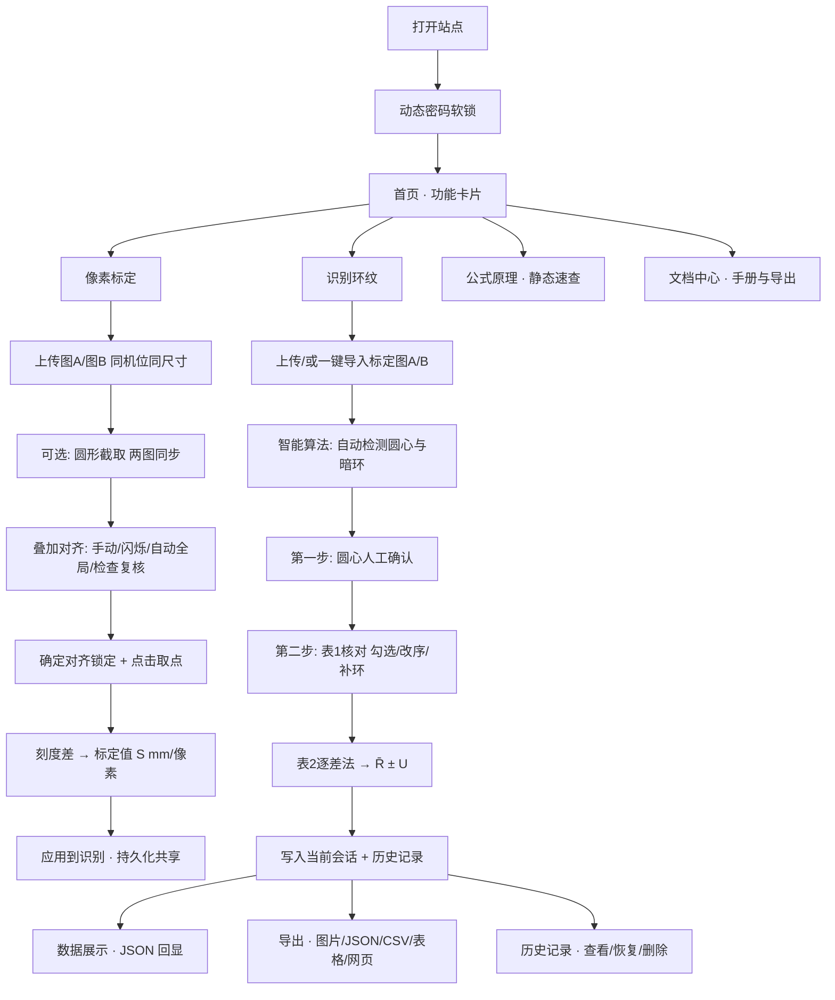

# 牛顿环数字化智能测量系统 · 补充材料

> 大学生物理实验竞赛参赛作品补充说明。本文聚焦**物理实验本身**、**网页各板块的功能与流程**、**内置智能算法（AI/智能化）如何落地**与**创新点**，不涉及代码与技术栈细节。

---

## 摘要（30 秒读懂）

牛顿环测曲率半径是经典的等厚干涉实验，传统做法依赖读数显微镜**人工对准、逐环读数**，存在对准误差大、读数繁琐、数据处理与不确定度评定易出错等痛点。

本作品把整条实验链搬到网页上，做成一套「**拍照 → 智能识别 → 人工核对 → 自动算 R 与不确定度 → 一键导出留档**」的数字化测量系统：

- **物理内核不打折**：严格遵循暗环公式、逐差法、五步不确定度评定与修约规则；
- **把重复劳动交给算法**：圆心、暗环、双图对齐由内置智能算法自动完成，人只做「核对」这一关键判断；
- **人在环（Human-in-the-loop）**：每一步自动结果都可人工微调、剔错、补环，算法辅助而非替代；
- **零门槛使用**：打开网页即用，无需安装，可扫码访问，结果可导出为图片/表格/网页/CSV 直接写进实验报告。

一句话：**用智能化手段把「显微镜里数环」升级为「照片上点环」，让测量更快、更准、更可复现。**

---

## 一、实验背景与要解决的痛点

### 1.1 实验任务
用牛顿环（平凸透镜 + 平面玻璃形成的空气薄膜等厚干涉）测量平凸透镜的**曲率半径 R**。钠光（波长 λ）照射下，反射光干涉形成一系列同心暗环，测出若干暗环直径即可反解 R。

### 1.2 传统方法的痛点
| 环节 | 传统做法 | 痛点 |
|---|---|---|
| 对准 | 读数显微镜十字丝逐环对准 | 人眼对准有主观误差，回程差易引入 |
| 读数 | 左右两侧各读一次、手工相减 | 繁琐、易读错、易记错环序 |
| 环序 | 人工数「第几级暗环」 | 中心接触形变处环序模糊，易数错 |
| 数据处理 | 手算逐差、平方、单位换算 | 计算量大、易算错 |
| 不确定度 | 手工五步评定 | 步骤多、公式易套错、修约易违规 |

本作品针对以上每一环给出数字化解法（见第四、五节）。

---

## 二、测量原理（物理内核）

### 2.1 暗环半径公式
空气薄膜等厚干涉，第 k 级暗环满足：

$$r_k=\sqrt{k\lambda R}\quad\Rightarrow\quad D_k=2r_k=2\sqrt{k\lambda R}$$

### 2.2 逐差法消除系统误差
透镜与玻璃接触处有形变，圆心暗斑级次不为零，直接用 \(r_k^2=k\lambda R\) 会带入系统误差。取相隔 \(m-n\) 的两暗环直径平方作差可消去常数项：

$$D_m^2-D_n^2=4(m-n)\lambda R\quad\Rightarrow\quad \boxed{R=\dfrac{D_m^2-D_n^2}{4(m-n)\lambda}}$$

作品默认步长 \(m-n=5\)，可在识别页调节。计算时直径以 mm 计、波长以 m 计，需作 \(\text{mm}^2\to\text{m}^2\)（乘 \(10^{-6}\)）单位换算。

### 2.3 像素 → 毫米换算（标定的物理意义）
图像中量得的直径是**像素**，须经像素标定系数 S（mm/像素）换算为真实长度：

$$D\,[\text{mm}]=D_{\text{px}}\,[\text{px}]\times S\,[\text{mm/px}]$$

S 由「像素标定」页测得：转动测微鼓轮移动**已知距离**，前后同机位拍两张图，用「物理距离 ÷ 像素距离」求出 S。这是把「像素世界」锚定到「真实物理世界」的关键一步。

### 2.4 五步不确定度评定（A 类 + B 类）
系统内置完整评定链，自动计算：

| 步骤 | 内容 | 公式 |
|---|---|---|
| ① | 仪器示值误差限的 B 类分量 | \(u_B(x)=\Delta/k\) |
| ② | 直径由左右两读数相减，合成 √2 倍 | \(u_B(D)=\sqrt{2}\,u_B(x)\) |
| ③ | 对逐差公式作误差传播，得 R 的 B 类相对不确定度 | \(\dfrac{u_B(R)}{R}=\dfrac{2u_B(D)}{D_m^2-D_n^2}\sqrt{D_m^2+D_n^2}\) |
| ④ | 多组 R 的 A 类统计（实验标准差 s 与均值标准不确定度） | \(u_A=\dfrac{s}{\sqrt{k}},\ \nu_A=k-1\) |
| ⑤ | A、B 类方和根合成，再乘包含因子得扩展不确定度 | \(u_C=\sqrt{u_A^2+u_B^2},\ U=k\,u_C\) |

最终结果表达为 \(R=(\bar R\pm U)\ \text{m}\)，并给出相对不确定度 \(U_R=U/\bar R\)。

**修约规则**（严格执行）：U 一般保留 1 位有效数字（首位为 1 或 2 时保留 2 位），采用「只进不舍」；\(\bar R\) 末位与 U 对齐，采用「四舍六入五成双」。

### 2.5 关键常量
| 符号 | 含义 | 取值 |
|---|---|---|
| λ | 钠光波长 | 589.3 nm = 5.893×10⁻⁷ m |
| Δ | 读数显微镜示值误差限 | 0.002 mm |
| m−n | 逐差法环序差（步长） | 默认 5，可调 |
| S | 像素标定系数 | mm/像素，标定页设定 |

---

## 三、系统总览

系统由 8 个板块组成，主线是「**先标定 → 后识别 → 再导出/留档**」，标定值与识别结果跨板块自动共享。

| 板块 | 一句话职责 |
|---|---|
| 首页 | 功能卡片导航入口 |
| 像素标定 | 求 mm/像素 长度基准 |
| 识别环纹 | 识别圆心与暗环、算 R 与不确定度（核心） |
| 公式原理 | 物理公式与常量的静态速查 |
| 数据展示 | 导入结果 JSON 回显表1/表2/不确定度 |
| 导出结果 | 五种格式导出，直接写进报告 |
| 历史记录 | 本地留存、查看/恢复/删除（最多 20 条） |
| 文档中心 | 内置手册 + 通用 Markdown 查看与导出 |

---

## 四、各板块功能与流程逐一详解

### 4.1 像素标定（长度基准的来源）

**目的**：转动测微鼓轮移动已知距离，前后同机位拍两张图，求出真实 mm/像素。页面顶部自带 5 步操作指引卡，按序做即可。

1. **上传图A（移动前）/图B（移动后）**：必须同机位、同尺寸；尺寸不一致会红字告警且无法叠加，从源头保证标定可靠。
2. **鼓轮刻度**：分别输入两图对应的读数显微镜刻度，系统用 \(|\text{刻度}_A-\text{刻度}_B|\) 自动算出物理距离（3 位小数），也允许手动覆盖为实测移动距离。
3. **✂️ 圆形截取（可选）**：在图A上拖圆框选中心环区，拖圆内移圆心、拖右侧红手柄改半径（滑块 / ± 按钮 / 键盘 `+` `−` / 方向键四种方式等价），确认后两图按**相同位置**同步剪下同一块区域，排除边缘干扰。
4. **🔍 叠加对齐**（图A为底、图B半透明）：
   - **手动**：Δx/Δy 滑块或方向键微调（Shift 加速 5px）；
   - **👁 闪烁对比**：两图快速交替显示——错位时环纹「跳动」、对齐后跳动消失，把「对齐没对齐」变成一眼可辨的动态信号；
   - **🤖 自动全局对齐**：从任意偏移一键求解平移量（整图相关 + 置信闸门，亚像素级）；
   - **🔍 检查对齐**：给出权威残差 + 置信度 + 调整方向建议（环纹具自相似性，肉眼「看似重叠」不可信，以此结果为准）；
   - **🔒 确定对齐**：锁定偏移后方可取点。
5. **取点**：在叠加画面上点击同一物理特征点，每点一次新增一组（A/B 坐标、ΔX、ΔY、像素距离、该组标定值），可单删/清空。
6. **标定值**：\(S=\) 物理距离 ÷ 像素距离（多组取平均，固定 4 位有效数字），点「**应用到识别**」写入跨页共享并持久化——刷新后识别页仍在。

> **巧思**：圆形截取时系统实际存的是**方形内切框**而非圆形抠图。因为圆外透明像素会被算法读成纯黑，而人工圆边在两图位置完全相同，会把对齐「锁死」在偏移≈0 而环纹依旧错开——存方形才能保证对齐由真实环纹驱动。

### 4.2 识别环纹（核心板块）

**两步式流程，先定圆心再认环，把「自动」与「人工核对」清晰分离。**

1. **图像来源**：
   - 点击或拖拽上传牛顿环照片（支持多选批量）；
   - 或点「**导入图A / 导入图B**」，把像素标定环节上传的两张图直接拉进识别流程，免去重复上传；
   - 存入前自动压缩，兼顾清晰度与浏览器存储上限。
2. **🎯 第一步 · 圆心确认**：智能算法自动给出圆心后，人可拖拽 / 方向键微调（Shift 5px）/ 直接输入 X、Y / `+` `−` 调十字臂长；**圆心允许移出图片**（当光学中心在画面外时，边缘画指向箭头并动态重算搜索半径）；不满意可「重新检测」。
3. **✋ 第二步 · 环人工核对**（表1）：
   - 取消勾选剔除误检环、编号可直接改；
   - 一键**顺延重排**：启用环按半径重新编号 1..N；
   - 漏检时**点击图像该半径处补环**，或「**⛶ 全屏放大补环**」（滚轮缩放 / 拖拽平移 / 点击补环 / ESC 关闭）；
   - 未勾选的环不参与计算与绘图；表格与图像双向联动高亮。
4. **标定值**：页顶显示当前 S 可手改；未设定（空 / ≤0）时，直径 mm 列与 R 降级为「—」、不确定度告警、CSV 导出被拦截，并给出「去标定页获取标定值」入口。
5. **结果**：
   - **表1**：各环直径（像素 2 位小数 / mm 3 位小数）；
   - **表2**：逐差法计算（步长 m−n 默认 5，可调）；
   - **\(R=\bar R\pm U\)**：五步不确定度评定明细可展开查看。
6. **留档**：一键保存到历史并同步当前会话（标注图 + 数据），或跳转导出页。

> **物理严谨性**：算法按半径升序编号 1..N，隐含「最内圈 = 第 1 级暗环」假设；若中心暗斑级次不为零，用户可在核对环节人工改编号，逐差法本身也已消除该常数系统误差。

### 4.3 公式原理
等厚干涉暗环公式、逐差法推导、像素换算、五步不确定度评定与常量速查表的**静态页面**，用 KaTeX 渲染公式，供测量与数据处理时随时对照，与实测数值页解耦。

### 4.4 数据展示
导入导出的结果 JSON，回显表1/表2/不确定度（与导出格式**互逆**）；当前已有识别会话时可一键载入，免去 JSON 往返。适合复算、复核、跨设备查看。

### 4.5 导出结果
导出源优先当前会话，其次页面导入的 JSON。提供五种格式：
- **标注图片 PNG**（含环与圆心标注，可直接贴进报告）；
- **结果 JSON**（结构化数据，供数据展示页回显）；
- **CSV**（含 BOM，Excel 打开不乱码）；
- **表格 Markdown**；
- **网页 HTML**。

### 4.6 历史记录
2×2 图片方格展示历次测量；支持查看 / 恢复（写回当前会话）/ 删除 / 清空；最多 20 条，超出按 LRU 淘汰最旧。本地留存，方便对比多次测量。

### 4.7 文档中心
内置用户手册 + 通用 Markdown 查看器：本地 `.md/.txt` 拖入即开新标签页预览，`.zip` 自动展开并映射包内图片；导出支持 md / doc / png / 打印 PDF。**下载内容一律附加水印**（屏幕水印开关不影响导出），便于成果溯源。

### 4.8 首页与全局设计
- **动态密码软锁**：4 位密码 = 日×2 拼接 时×2，每整点变化，当前或前一小时密码均有效，纯前端「防君子」，到期自动失效；
- **图像引擎按需加载**：约 10 MB 的图像处理引擎进入页面**不预载**，首次执行识别动作时才加载（按钮呈 loading 态），显著加快首屏；
- **深浅主题切换 + 水印开关**：均持久化；
- **本站二维码**：随当前 host 生成，讲课/答辩扫码即用；
- **左侧菜单**由路由表单一来源生成，移动端为左抽屉。

---

## 五、智能化（AI）如何落地

本作品的「智能」不依赖云端大模型，而是把**计算机视觉与数值拟合算法**内置进网页，将传统实验里最耗时、最依赖经验的判断自动化。核心有五处：

### 5.1 圆心自动识别（三级兜底 + 精修）
1. 霍夫变换检测外边界圆；
2. 失败则用亮度加权质心兜底；
3. 再以「**圆周亮度标准差最小**」为判据精修圆心。

> 物理巧思：牛顿环是同心圆，正确圆心处各方向环纹最规整；用「圆周亮度标准差最小」把「找圆心」变成一个可优化的物理判据，比单纯几何拟合更抗噪。

### 5.2 暗环自动识别（剖面 → 极小 → 聚类 → 拟合）
多角度径向剖面 → 找局部极小（暗环）→ 非极大值抑制去重 → 半径聚类归并 → **\(r^2\propto m\) 线性拟合精修**。

> 关键创新：不只「找到暗环」，还用暗环应满足的物理规律 \(r^2\propto m\) 反过来**线性拟合精修半径**，让识别结果与物理模型自洽，抑制单点噪声。

### 5.3 双图全局对齐（图像配准）
标定页「自动全局对齐」用**整图相关 + PSR 置信闸门**求解两图平移量，达亚像素精度且**不假阳性**（置信度不足时明确告知「未能可靠求解」，而非给一个错误结果）。

### 5.4 对齐残差复核
「检查对齐」通过**拟合两图各自的环系圆心**给出权威残差与调整方向建议，解决环纹自相似导致「肉眼看似对齐其实没对齐」的陷阱。

### 5.5 不确定度自动评定
五步评定链（B 类误差传播 + A 类统计 + 合成扩展 + 规范修约）全部自动完成，杜绝手算套错公式与修约违规。

> **设计哲学：算法辅助，人来把关（Human-in-the-loop）。** 所有自动结果都开放人工微调、剔错、补环与改编号——把重复劳动交给算法，把关键物理判断留给人。

---

## 六、巧思与人性化设计一览

| 巧思 | 解决的问题 |
|---|---|
| 👁 闪烁对比 | 把「对齐误差」变成一眼可辨的动态跳动信号 |
| 圆形截取存方形 | 避免透明边被当纯黑而「锁死」对齐 |
| 圆心可移出图外 + 指向箭头 | 光学中心不在画面内时仍能测量 |
| 全屏放大补环 | 漏检环可按半径精准补入 |
| 顺延重排编号 | 剔环后一键重编 1..N，免手改 |
| 自动全局对齐 + PSR 闸门 | 亚像素对齐且不假阳性 |
| 检查对齐给方向建议 | 破解环纹自相似的「假对齐」陷阱 |
| 引擎按需加载 | 首屏快，重资源用到才载 |
| 跨页共享 + 持久化 | 标定值/结果刷新不丢，多页协作 |
| 导入标定图A/B | 标定图一键进识别，免重复上传 |
| 五种导出 + 水印 | 结果直接进报告，且可溯源 |
| 动态密码软锁 | 轻量防君子，答辩期可控访问 |
| 本站二维码 | 扫码即用，利于教学推广 |

---

## 七、创新点总结

1. **测量范式创新**：把「读数显微镜人工对准逐环读数」升级为「照片上智能识别 + 人工核对」，从接触式逐点测量走向非接触式整场测量，效率与可复现性大幅提升。
2. **算法与物理深度融合**：圆心识别用「圆周亮度标准差最小」、暗环识别用「\(r^2\propto m\) 线性拟合精修」、对齐用「整图相关 + PSR 闸门」——每个算法都嵌入牛顿环的物理规律，而非通用图像处理照搬。
3. **完整闭环的严谨数据处理**：从像素标定（长度基准）→ 逐差法 → 五步不确定度评定 → 规范修约，全链条自动且可展开复核，物理口径严格。
4. **人在环的可信自动化**：自动结果全部可人工干预，兼顾效率与可信度，符合实验测量「可追溯、可复核」的要求。
5. **零门槛与可推广性**：纯网页、免安装、可扫码、支持深浅主题与多格式导出，既是测量工具，也可作为实验教学与演示载体。
6. **工程体验巧思密集**：闪烁对比、圆形截取存方形、圆心移出图外、全屏补环等细节，均来自对真实实验痛点的洞察。

---

## 八、结论与展望

本作品以牛顿环测曲率半径这一经典实验为载体，用内置智能算法把最耗时的对准、读数、对齐、数据处理与不确定度评定自动化，同时保留人工核对的关键判断，实现「**更快、更准、更可复现、更易推广**」的数字化测量。

**展望**：进一步引入更稳健的环级次自动判定（减少「最内圈=第1级」的人工确认）、支持批量照片的自动流水线处理，并探索把测量结果与误差分析自动生成实验报告初稿。

---

*本文为竞赛补充材料，配套作品为「牛顿环数字化智能测量系统」网页。*
